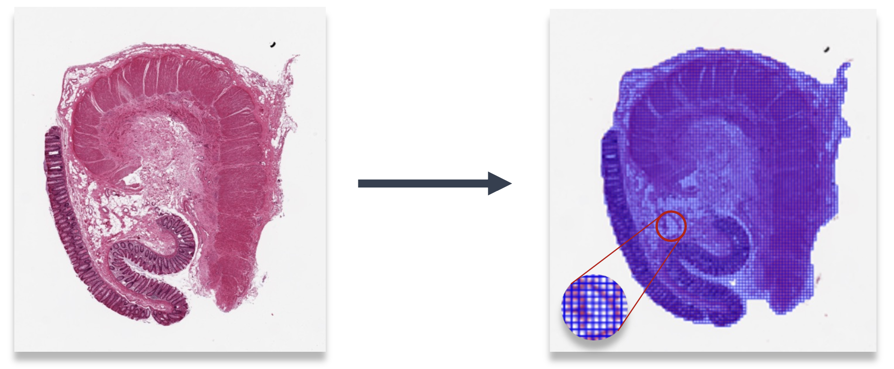

# Self-supervised learning for characterising histomorphological diversity and spatial RNA expression prediction across 23 human tissue types
_Francesco Cisternino, Sara Ometto, Soumick Chatterjee, Edoardo Giacopuzzi, Adam P. Levine, Craig A. Glastonbury_

[Check out the biorxiv preprint](https://www.biorxiv.org/content/10.1101/2023.08.22.554251v1).

# WSI Preprocessing
## 1. Segmentation
Segmentation allows to separate the tissue from background in WSIs. The output are binary masks (stored as .jpeg).
```
python preprocessing/segmentation_patching/segmentation.py
```
* Parameters configuration in preprocessing/segmentation_patching/config.yaml


## 2. Tiling
The tissue region of WSI, identified by segmentation, is divided into small squared tiles (or patches) (e.g. 128x128); this allows both to process the WSI through GPU and to obtain local (tile-level) results.
```
python preprocessing/segmentation_patching/tiling.py
```
* Parameters configuration in preprocessing/segmentation_patching/config.yaml
* The weights of the ViT-S trained on 1.7M tiles from 23 GTEx tissues is available at (link to big files folder).
* The output of patching for each slide is a .h5 file containing a 2D array of shape (K, 2) - where K is the number of tiles - with the upper left corner coordinates of each tile.




## 3. Features extraction

Tile images are turned into features vectors capturing their morphological content. To do this, we use a vision transformer (ViT-S) trained on 1.7 M histology patches using a self-supervised approach.
```
python preprocessing/features_extraction/extract_features.py
```
* Paramters configuration in preprocessing/features_extraction/config.yaml
* The output of features extraction for each slide is a .pt file containing a 2D tensor of shape (K, 384), where K is the number of tiles and 384 the number of features.
* During features extraction, white patches that could have been included in the tissue mask are filtered out; tipically this happens if there are very small holes in the tissue sample. For this reason, we also store a .h5 file for each slide containing both the features and the final list of coordinates.

_[WIP - We are still transfering code from our internal gitlab to this github repo but we wanted to make this public asap.]_


# RNAPath


## 1. Training

RNAPath training requires patch features to represent WSIs, train/validation/test splits, a txt indicating the list of genes to be profiled (example in ./resources/gene_set_example.txt) and a csv file with the genes TPMs (link to big files folder).
The training script requires some arguments to be set:
* exp_code: experiment code to identify logs and results of the actual run
* tissue_code: alphanumeric code to indentify the tissue of interest
* data_root_dir: main directory of patch features
* split_dir: directory of splits (if not specified, it will be ./splits/RNAPath_{tissue_code}) (default: None)
* results_dir: directory where results will be stored (default: './results')
* max_epochs: maximum number of epochs (default: 200)
* lr: starting learning rate (default: 1e-4)
* lr_scheduler: learning rate scheduler; choices are 'constant' and 'plateau'; in the latter case, the lr drops after 10 epochs without validation loss improvement (default: 'plateau')
* label_frac: fraction of training labels (default: 1.0)
* reg: weight decay (default: 1e-3)
* seed: random seed for reproducible experiment (default: 1)
* log_data: log data using tensorboiard (default: False)
* early_stopping: whether to enable early stopping; training stops after 20 epochs without validation loss improvements (default: True)
* bag_droput: whether to apply droput to bag instances (default: True)
* opt: optimizer; possible choices are 'adam' and 'sgd' (default: 'adam')

```
python train.py --exp_code test_0 --tissue_code HEA --data_root_dir /path/to/features/dir
```

During training, training and validation loss values will be logged and a results folder will be created (inside results_dir) and named as the experiment code; in this folder, the gene-level r-scores for both validation and test set and the weights checkpoint file will be stored.

## 2. Inference and visualization

### 2.1 Inference

At inference, trained models are used to infer patch-level expression. Patch logits are stored as .pt files and can be used to plot heatmaps of the genes of interest.
The inference scripts requires the following arguments:

* tissue_name: name of the tissue (e.g. Heart, Colon, Skin, EsophagusMucosa for GTEx)
* tissue_code: alphanumeric code to indentify the tissue of interest
* features_dir: main directory of patch features
* output_dir: directory where patch logits will be stored
* results_dir: trainig results directory
* ckpt_path: path to RNAPath model checkpoint
* multiple_patch_sets: if multiple partially overlapping patch sets are used for the same slide (default: False)

```
python inference.py --tissue_name Heart --tissue_code HEA --features_dir /path/to/features/dir --output_dir /path/to/patch_logits/dir --results /path/to/results/dir --ckpt_path /path/to/rnapath/checkpoint.pt --multiple_patch_sets
```

### 2.2 Visualization


