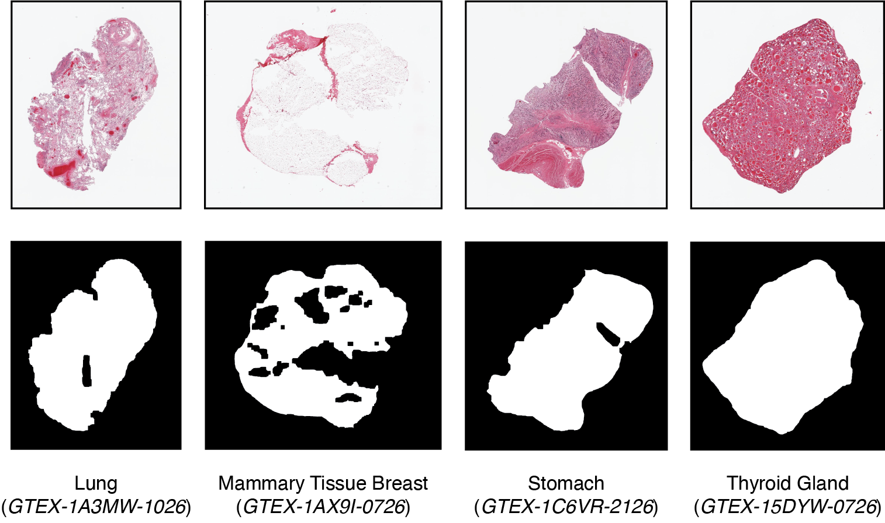

# Self-supervised learning for characterising histomorphological diversity and spatial RNA expression prediction across 23 human tissue types
_Francesco Cisternino, Sara Ometto, Soumick Chatterjee, Edoardo Giacopuzzi, Adam P. Levine, Craig A. Glastonbury_

[Check out the biorxiv preprint](https://www.biorxiv.org/content/10.1101/2023.08.22.554251v1).

# WSI Preprocessing
## 1. Segmentation
Segmentation allows to separate the tissue from background in WSIs. The output are binary masks (stored as .jpeg).
```
python preprocessing/segmentation_patching/segmentation.py
```
* Parameters configuration in preprocessing/segmentation_patching/config.yaml




## 2. Tiling
The tissue region of WSI, identified by segmentation, is divided into small squared tiles (or patches) (e.g. 128x128); this allows both to process the WSI through GPU and to obtain local (tile-level) results.
```
python preprocessing/segmentation_patching/tiling.py
```
* Parameters configuration in preprocessing/segmentation_patching/config.yaml
* The output of patching for each slide is a .h5 file containing a 2D array of shape (K, 2) - where K is the number of tiles - with the upper left corner coordinates of each tile.


## 3. Features extraction

Tile images are turned into features vectors capturing their morphological content. To do this, we use a vision transformer (ViT-S) trained on 1.7 M histology patches using a self-supervised approach.
```
python preprocessing/features_extraction/extract_features.py
```
* Paramters configuration in preprocessing/features_extraction/config.yaml
* The output of features extraction for each slide is a .pt file containing a 2D tensor of shape (K, 384), where K is the number of tiles and 384 the number of features.
* During features extraction, white patches that could have been included in the tissue mask are filtered out; tipically this happens if there are very small holes in the tissue sample. For this reason, we also store a .h5 file for each slide containing both the features and the final list of coordinates.

_[WIP - We are still transfering code from our internal gitlab to this github repo but we wanted to make this public asap.]_


# RNAPath

